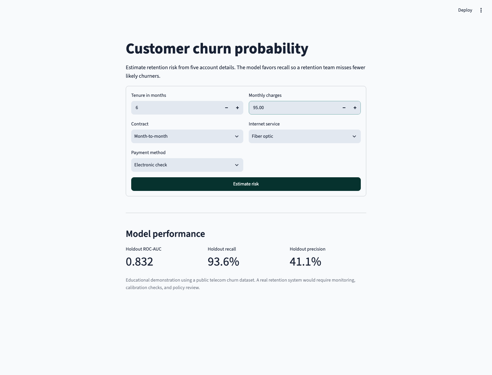

# Churn Probability

[](https://github.com/shlokbhutani13/churn-probability/actions/workflows/ci.yml)

I built this project to connect churn-model evaluation with a usable retention workflow. The Streamlit app estimates a customer's churn probability from five account details, and the repository includes the code that trains, evaluates, and tests the model behind it.

The model favors recall. It flags more customers for review so a retention team misses fewer likely churners, while accepting more false positives.



## Holdout results

The checked-in model uses a stratified 80/20 split of the IBM Telco Customer Churn dataset.

| Metric | Result |
| --- | ---: |
| ROC-AUC | 0.832 |
| Average precision | 0.627 |
| Recall | 93.6% |
| Precision | 41.1% |
| F2 | 0.746 |
| Decision threshold | 0.28 |

The threshold comes from out-of-fold training predictions and maximizes the F2 score. F2 gives recall more weight than precision. The holdout set remains separate until final evaluation.

## Application

The app asks for:

- tenure
- monthly charges
- contract type
- internet service
- payment method

It returns the estimated probability, a low/moderate/high risk band, and the model's decision at the saved threshold. The interface does not claim that any input caused the prediction.

Run it locally with Python 3.11 or newer:

```bash
git clone https://github.com/shlokbhutani13/churn-probability.git
cd churn-probability
python -m venv .venv
source .venv/bin/activate
pip install -e ".[dev]"
streamlit run app.py
```

## Training

```bash
python -m src.train
```

Training performs five-fold cross-validation over logistic-regression strength, selects an F2 threshold from out-of-fold predictions, and evaluates the fitted pipeline on the holdout split.

The command writes:

- `models/churn_model.joblib`
- `models/model_metadata.json`
- `reports/metrics.json`
- confusion-matrix, ROC, and precision-recall charts

The application and command-line predictor load the same model and metadata.

## Command-line prediction

```bash
python -m src.predict \
  --tenure 12 \
  --monthly-charges 70 \
  --contract "Month-to-month" \
  --internet-service "Fiber optic" \
  --payment-method "Electronic check"
```

## Verification

```bash
ruff check .
pytest
```

The tests cover data validation, threshold selection, metrics, artifact generation, prediction inputs, model loading, and a complete Streamlit interaction.

## Structure

```text
app.py                 Streamlit interface
src/data.py            feature and target validation
src/modeling.py        training, threshold selection, metrics, and charts
src/prediction.py      shared artifact loading and prediction
tests/                 unit, integration, and Streamlit tests
models/                checked-in deployable artifacts
reports/               holdout metrics and evaluation plots
```

## Limits

This is an educational model trained on a public sample dataset. A production churn system would need current company data, probability calibration, drift monitoring, fairness review, intervention-cost modeling, and outcome measurement.

## Dataset

The repository includes the IBM Telco Customer Churn sample used in IBM's archived [customer churn prediction project](https://github.com/IBM/customer-churn-prediction). See [data/README.md](data/README.md) for the selected fields.

## License

[MIT](LICENSE). The dataset retains its original terms and attribution.
